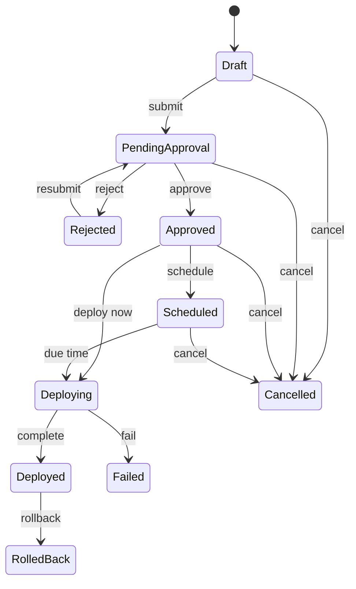
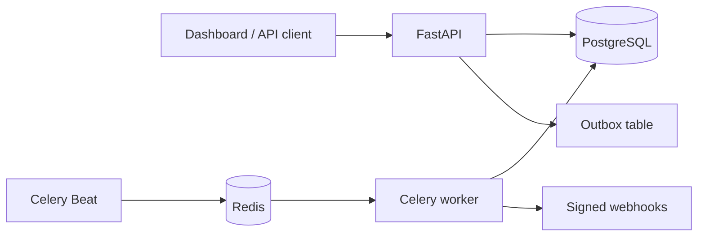

# Release Control

[](https://www.python.org/)
[](https://fastapi.tiangolo.com/)
[](https://github.com/Xiviam/release-control/actions/workflows/ci.yml)
[](LICENSE)

Release Control is a production-style control plane for release approval, scheduling,
deployment tracking and rollback. It combines a strict release state machine with RBAC,
an immutable audit trail, idempotent commands and reliable signed webhooks.

The repository includes both an async FastAPI backend and a responsive dashboard.

## Why this project exists

Deployments are not a single `POST /deploy` call. A useful release service must answer:

- Who created and approved the release?
- Is this transition valid for the current state?
- Can two requests change the same release safely?
- Can a client retry without creating duplicate releases?
- Will downstream systems receive events if a process crashes?
- Can an operator reconstruct the full history later?

Release Control implements those concerns explicitly rather than hiding them in route handlers.

## Release workflow



Every transition is checked in the service layer, executed under a row lock and written to the
audit log and outbox in the same database transaction.

## Highlights

- **Strict state machine** - illegal transitions return a structured `409` response.
- **RBAC** - `developer`, `reviewer` and `admin` roles have separate capabilities.
- **Approval gates** - environments can require review or auto-approve submitted releases.
- **Concurrency control** - `SELECT FOR UPDATE` plus SQLAlchemy optimistic versioning.
- **Idempotent creation** - repeated `Idempotency-Key` requests return the original release.
- **Scheduled deployment** - Celery Beat activates due releases without blocking API workers.
- **Transactional outbox** - domain events are stored atomically with state changes.
- **Signed webhooks** - HMAC-SHA256 signatures, delivery history and bounded retries.
- **Audit history** - actor, action, entity, timestamp and event metadata for every change.
- **Operational endpoints** - separate liveness (`/health`) and readiness (`/ready`) checks.
- **Quality gates** - Ruff, MyPy, pytest, coverage and GitHub Actions.
- **One-command environment** - API, worker, scheduler, PostgreSQL and Redis via Docker Compose.

## Architecture



The API owns synchronous validation and state changes. Background workers only process work
already committed to PostgreSQL, so a broker outage cannot lose a release event.

## Technology

| Area | Technology |
| --- | --- |
| API | FastAPI, Pydantic v2, OAuth2 Bearer/JWT |
| Persistence | PostgreSQL 16, SQLAlchemy 2 Async, Alembic |
| Background jobs | Celery, Redis, Celery Beat |
| Reliability | Row locks, optimistic locking, idempotency, transactional outbox |
| Webhooks | HTTPX, HMAC-SHA256, delivery log, retry budget |
| Frontend | Responsive HTML, CSS and vanilla JavaScript |
| Quality | pytest, pytest-asyncio, Ruff, MyPy, coverage, GitHub Actions |

## Quick start with Docker

Requirements: Docker and Docker Compose.

```bash
cp .env.example .env
docker compose up --build
```

Open:

- Dashboard: <http://localhost:8000>
- Swagger UI: <http://localhost:8000/docs>
- ReDoc: <http://localhost:8000/redoc>
- Health: <http://localhost:8000/health>

The bootstrap admin is configured in `.env`. Change the default password before exposing the
service outside a local environment.

## Local development

```bash
uv sync --extra dev
cp .env.example .env
uv run alembic upgrade head
uv run python -m app.cli bootstrap-admin
uv run uvicorn app.main:app --reload
```

Start the worker and scheduler in separate terminals:

```bash
uv run celery -A app.worker.celery_app worker --loglevel=INFO
uv run celery -A app.worker.celery_app beat --loglevel=INFO
```

## Example API flow

Obtain a token using the bootstrap admin:

```bash
curl -X POST http://localhost:8000/api/v1/auth/token \
  -H 'Content-Type: application/x-www-form-urlencoded' \
  -d 'username=admin@example.com&password=change-me-now'
```

Create a project:

```bash
curl -X POST http://localhost:8000/api/v1/projects \
  -H "Authorization: Bearer $TOKEN" \
  -H 'Content-Type: application/json' \
  -d '{"name":"Payments API","slug":"payments-api","description":"Production service"}'
```

Create a release safely:

```bash
curl -X POST http://localhost:8000/api/v1/releases \
  -H "Authorization: Bearer $TOKEN" \
  -H 'Idempotency-Key: payments-v1.4.0-production' \
  -H 'Content-Type: application/json' \
  -d '{
    "project_id":"PROJECT_UUID",
    "environment_id":"ENVIRONMENT_UUID",
    "version":"v1.4.0",
    "artifact_uri":"ghcr.io/acme/payments:v1.4.0",
    "commit_sha":"4a1dc9f6f790ab36b629b6ef09944f23f42c9d4c",
    "changelog":"Add idempotent payment capture"
  }'
```

Submit and approve it:

```bash
curl -X POST http://localhost:8000/api/v1/releases/RELEASE_UUID/submit \
  -H "Authorization: Bearer $DEVELOPER_TOKEN" \
  -H 'Content-Type: application/json' -d '{"comment":"Ready for review"}'

curl -X POST http://localhost:8000/api/v1/releases/RELEASE_UUID/approve \
  -H "Authorization: Bearer $REVIEWER_TOKEN" \
  -H 'Content-Type: application/json' -d '{"comment":"Checks passed"}'
```

## Webhook contract

Subscribers receive a canonical JSON envelope:

```json
{
  "id": "0d4cb0b5-10cb-4f5a-970f-6bbb605e115c",
  "type": "release.deployed",
  "created_at": "2026-08-10T12:00:00+00:00",
  "data": {
    "release_id": "a37f60ee-3500-414c-bc45-7644ef1677d4",
    "version": "v1.4.0",
    "status": "deployed"
  }
}
```

The signature is sent in `X-Release-Control-Signature` as
`sha256=<hex digest>`. Consumers should calculate HMAC-SHA256 over the raw request body and use
a constant-time comparison.

## Tests and quality checks

```bash
make check
```

Or run checks separately:

```bash
uv run ruff check .
uv run ruff format --check .
uv run mypy app
uv run pytest --cov=app --cov-report=term-missing
```

Tests run against an isolated async SQLite database for speed. The migration and container stack
target PostgreSQL, where row-level locks and the worker's `SKIP LOCKED` queries are exercised in
production-like runs.

## Repository structure

```text
app/
  api/          HTTP routes and dependencies
  core/         settings, security, enums and exceptions
  db/           async SQLAlchemy engine and declarative base
  models/       persistence models
  schemas/      request and response contracts
  services/     domain workflow and application logic
  static/       dashboard
  worker.py     scheduler and outbox publisher
alembic/        database migrations
tests/          API, state-machine and webhook tests
```

## Security notes

- Passwords are hashed with Argon2 through `pwdlib`.
- JWT secrets and webhook secrets are never committed; `.env` is ignored.
- The webhook secret is returned only by the create endpoint.
- Admin bootstrap credentials must be changed outside local development.
- In a larger deployment, webhook secrets should be encrypted with a KMS-backed key and JWT
  signing keys should be rotated.

## License

[MIT](LICENSE)

